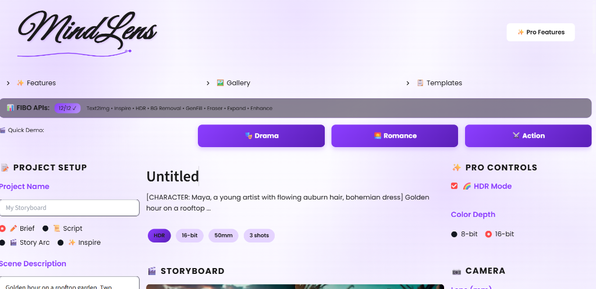
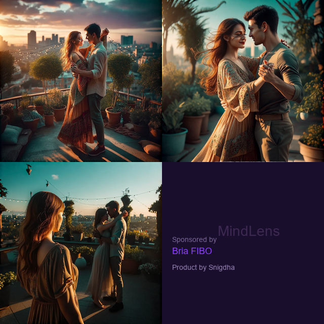

# MindLens - FIBO Continuity Director

**AI-Powered Storyboard Generation with Visual Consistency**



## What It Does

MindLens transforms text descriptions into professional visual storyboards. Describe a scene, and it generates consistent, high-quality images across multiple shots - maintaining the same character, lighting, and style.

**Built with [Bria FIBO API](https://bria.ai/)**

---

## Screenshots

### Generated Storyboard


### Sample Output


---

## Features

### 🎬 Core Generation
- **Text-to-Image** - Describe scenes, get professional visuals
- **Inspire Mode (Img2Img)** - Upload reference images for style transfer
- **Character Consistency** - Same character across different shots
- **HDR & 16-bit Color** - Professional color depth

### 🛠️ Pro Tools (Bria API V2)
- **Background Removal** (RMBG 2.0)
- **Generative Fill** - AI inpainting
- **Eraser** - Remove unwanted objects
- **Expand** - Outpainting to extend scenes
- **Enhance** - Upscale and improve quality

### 🎭 Creative Tools
- **AI Director** - Smart camera and lighting suggestions
- **Script Parser** - Convert screenplays to storyboards
- **Story Arc Generator** - Narrative templates
- **Quick Demo Templates** - Drama, Romance, Action, Sci-Fi, Horror, Product

### 📤 Export Options
- PDF Storyboard
- Word Document (with embedded images)
- Video slideshow
- PNG Grid

---

## API Integrations

This project integrates **12 Bria FIBO API endpoints**:

| API | Use Case |
|-----|----------|
| Text-to-Image | Core generation |
| Image-to-Image (Inspire) | Style transfer |
| RMBG 2.0 | Background removal |
| Generative Fill | Inpainting |
| Eraser | Object removal |
| Expand | Outpainting |
| Enhance | Upscaling |
| HDR Mode | Professional color |
| 16-bit Depth | Color accuracy |
| Camera Controls | Lens/angle parameters |
| Negative Prompts | Quality control |
| Aspect Ratio | Format control |

---

## Quick Start

### 1. Clone & Install
```bash
git clone https://github.com/snigdhareddy482/fibo_continuity_director.git
cd fibo_continuity_director
pip install -r requirements.txt
```

### 2. Set API Key
```bash
# Windows PowerShell
$env:FIBO_API_KEY="your_api_key_here"

# Mac/Linux
export FIBO_API_KEY="your_api_key_here"
```

### 3. Run
```bash
streamlit run app/ui/main.py
```

---

## Usage

1. **Enter a scene description** - "A detective in a dim interrogation room"
2. **Add character details** - "Detective Sarah, 40s, dark blazer"
3. **Click Generate** - Get your storyboard
4. **Use Pro Tools** - Edit with background removal, inpainting, etc.
5. **Export** - Download as PDF, Word, or video

---

## Architecture

```
app/
├── ui/
│   ├── main.py          # Streamlit frontend
│   └── pages/           # Features, Gallery, Templates
├── core/
│   ├── client.py        # FIBO API wrapper
│   ├── engine.py        # Generation orchestrator
│   ├── planner.py       # Brief → Shot plan
│   ├── director_agent.py # AI camera suggestions
│   ├── script_parser.py  # Screenplay parser
│   └── export_tools.py   # PDF/Word export
└── models/
    ├── config.py        # Settings
    └── schemas.py       # Data models
```

---

## Tech Stack

- **Python 3.10+**
- **Streamlit** - UI framework
- **Bria FIBO API** - AI image generation
- **Pillow** - Image processing
- **ReportLab** - PDF generation
- **python-docx** - Word export
- **MoviePy** - Video generation

---

## Author

**Snigdha** - [GitHub](https://github.com/snigdhareddy482)

---

## Acknowledgments

Built with [Bria AI](https://bria.ai/) FIBO API

---

*Powered by Bria FIBO | Product by Snigdha*
